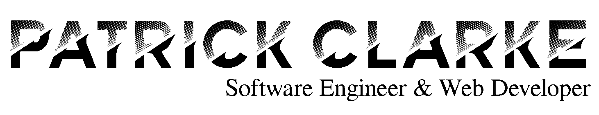

# Hi there, I'm Patrick Clarke 👋 🇯🇲
I am a passionate Software Engineer that specializes in  Web Applications. I am a voracious non-fiction reader which is how I learned how to program in C++ since I was 16. Then I moved on to Web Programming and other technologies all through to University and I'm still learning in my free time.

**Education:** University of Technology, Jamaica 
**Degree:** Bachelor of Computing&nbsp;&nbsp;**Major** Computer Science 
**Links** to my [Portfolio](http:portfolio.valleyofcode.com) & [Resume](http://portfolio.valleyofcode.com/assets/pdf/resume-creative.pdf) 
**Social**: Facebook • Instagram • Twitter • [Linkedin](www.linkedin.com/in/patrick-clarke-pc) • [Github](https://github.com/iipajcii) (You are Here)
## Skills and Knowledge
### 🌳 Deep Knowledge and Skills: 
Skills in this section are the skills I use most often and on a project I use a combination of them
- 🌐 **Web Development (4.9/5)** - Currently, Web Development is my most cultivated skill. From basic HTML, CSS, Javascript and PHP to Laravel, Node.js, Vue.js, Bulma and Bootstrap

- 🗄 **Laravel (4/5)** - Laravel is the PHP Framework I currently use most often when making websites.

- 📃 **Vue.js (4/5)** - Since 2020 every component in my web projects use Vue.js as well as it's supporting frameworks such as Vuex

- 🎨 **CSS Frameworks (4.5.5)** - My CSS Framework of choice is _Bulma.io_. I know how to use other frameworks without trouble such as *Bootstrap*.

- 🔐 **Linux Administration (3.5/5)** - Since 2019 I've worked on a Linux Machine (Linux Mint) and I am more productive on my projects than with a Wndows machine. I've had to learn the basics of system administration and know intermediate system admistration such as firewall management (using ufw), user management, and service management.

- 🗄 **PHP (5/5)** - PHP Is the language I started doing Back-end Development (2017) with and I still use it for most of my projects through the *Laravel* Framework.

- 📜 **Javascript (4.5/5)** - Javascript took some getting used to, but I did it. I mainly use it for browser applications but I know how to use it with other technologies such as *Node.js*

- ⚙️ **C & C++ (4/4)** - I mainly use these languages for school assignments but I know how powerful they can be. I started learning them because in the introduction I was told that they can be used for GUI appications, Operating Systems, Network Applications, Image Editors etc. Most courses only showed how to make Console Applications. It wasn't until later on that I learned that *External Libraries* would have to be used to make this possible. I haven't done these with C or C++ yet but I intend to in the future.

- 💾 **Git and Github (4/5)** - It was around 2019 where I learned about Git and late 2020 where I started uploading the projects to my Github regularly. Working with Git in my projects is a breeze and collaborating on a repository with other developers is manageable for me

### 🌿 Some Knowledge and Skills:
Skills in this section I have knowledge on and personal experience using it but I don't use it often.
- 🐳 **Docker (2.5/5)** - I know docker is a very useful tool that can be used to export and run projects run on many computers without trouble. I mainly use to to test out software, I don't really export with it, Git and GitHub are my current solutions.

- 📦 **Webpack (2/5)** - I normally use Webpack through another framework such as Laravel Mix. I do know how to make simple `webpack.config.js` files from scratch.

- 🖨 **Wordpress (2.5/5)** - Wordpress is great for making business sites and blogs like my website [Valley of Code](https://valleyofcode.com). However I find it easier to make a website myself; I find Wordpress restrictive. <s>I often find it as more of a restriction than a help, I have read a couple books and many articles on Wordpress  but customizing the sites is the hardest part for me. If I was writing a site with HTML, CSS, and JS I would have a better time using it but I don't have that unless I'm making a custom theme.</s> Perhaps I just need more practice but I don't use it unless I'm making a quick blog site.

- ☕️ **Java (3/5)** - I have used Java in University to make things from Simple Console Applications to Desktop GUI Applications. However I don't use it as a day-to-day programming language

- 🗄 **Apache Server (2.8/5)** - Apache Server is what I normally use to run PHP Web Servers. I thus have knowledge on how to properly configure the server using the *apache2.conf* and *.htaccess* files. Most settings are rare for me to change such as showing the directory index, changing the server root, or creating a new `<Directory>`

- 🗄 **Nginx Server (1/5)** - Nginx Servers are normally faster than Apache. I have read how to use it but not much practical expreience with it since the hosting providers I use use Apache and setting up PHP is tedious.

- 📚 **Algorithms and Data Structures (4.5/5)** - I've noticed that persons are most curious about a programmer's theoretical and practical knowledge of Data Structures (DS) and Algorithms. For context I am fully capable of constructing DS from Linked Lists to Trees, creating the relevant methods to operate on these structures from scratch is not hard for me either; If a DS is new to me it often doesn't take me long to learn how to construct it. I mostly use C and C++ when implementing DS. For context, most of my work as a web developer requires me to use PHP and Javascript and thus *doesn't require me to use or construct DS from scratch*. 
 
### 🌱 Currently Learning:
- 💣 **Hacking and 🔒 Security** - Knowledge of security is critical to keep user and client information safe on the web. In my opinion a persons knowledge of security is only half-completed if they don't know about hacking. Figuratively they are the two sides of the same coin. In a *Harry Potter* context these two skills are 'Dark Arts' and 'Defense Against the Dark Arts'

- ⚙️ **Assembly Language** - In order to have a deeper understanding on how a computer works I find it necessary do dive into Assembly Language. A Personal goal of mine is to make a basic operating systemI also want to use it to make an operating system

- 📱 **Mobile Application Development** - I specialize in creating websites but I don't know how to create mobile applications. My value as a developer would grow imensely if I can create great web **and** mobile applications. For any entity that would practically cover their presence on the internet.

- 🧠 **Artificial Intellegence and Machine Learning** - I know that AI and ML are skills that are highly valued now and are likely to have more widespread use in the future.  Learning this is not my main priority though, I tend to focus on learning about a couple areas of knowledge for months before moving on.

- 🔗 **Blockchain Development** - This is an area of interest for me. I'm not too sure how useful it will be to me, but I no doubt think that learning about it's concepts will help me to be a better developer.

- ⌨️ **High-Level Languages** - A List of Programming Languages that I am learning. It doesn't take me long to learn a new language these days (except for assemly language, that's taking some time to learn).
  - ⌨️ Go
  - 🐍 Python

<!--
**iipajcii/iipajcii** is a ✨ _special_ ✨ repository because its `README.md` (this file) appears on your GitHub profile.

Here are some ideas to get you started:

- 🔭 I’m currently working on ...
- 🌱 I’m currently learning ...
- 👯 I’m looking to collaborate on ...
- 🤔 I’m looking for help with ...
- 💬 Ask me about ...
- 📫 How to reach me: ...
- 😄 Pronouns: ...
- ⚡ Fun fact: ...
-->
